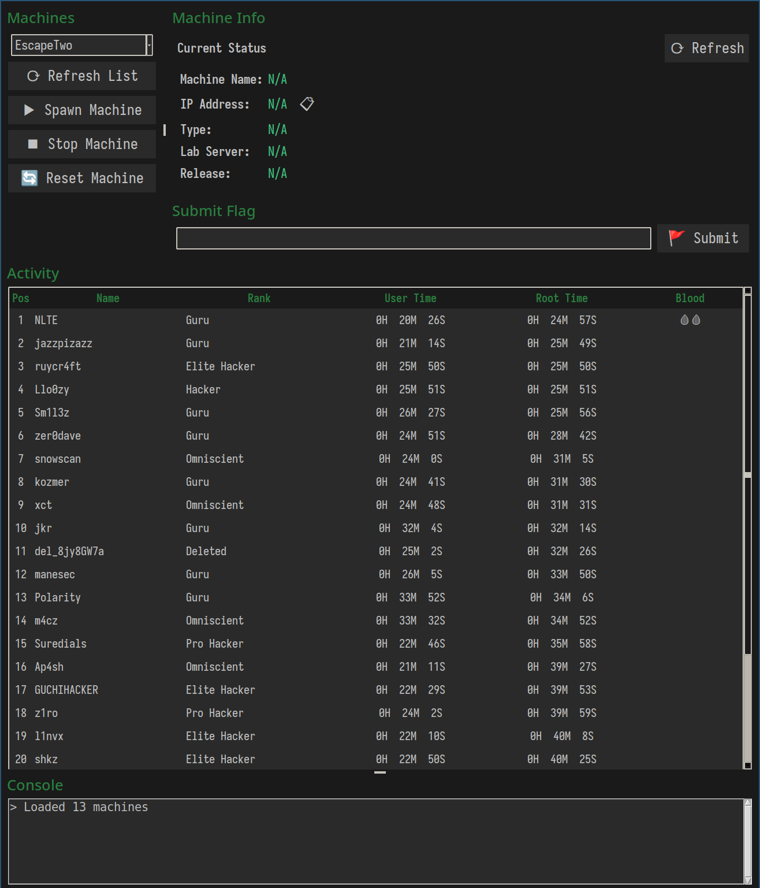

# HTB Simple GUI 🛠️

[](https://www.python.org/downloads/)
[](https://opensource.org/licenses/MIT)

Unofficial application to interact with machines through the HTB API.



## Key Features 🔥

- 🚀 **Full Machine Control**
  - Spawn/Stop/Reset with a single click
  - Precise launch timer
  - Real-time status of the active machine

- 🎯 **Smart Flag Management**
  - Direct flag submission
  - Activity history with solution times (top 25)
  - Blood detection (first solvers)


## Requirements 📦

- Python 3.9+
- HTB API token

## Installation ⚙️

1. **Clone the repository**
```bash
git clone https://github.com/L1nvx/htb-simple-gui.git
cd htb-simple-gui
```

2. **Install dependencies**
```bash
pip install -r requirements.txt
```

3. **Configure your HTB token**
```bash
echo "TOKEN=your_htb_token_here" > .env
```

4. **Run the application**
```bash
python app.py
```

## Basic Usage 🖱️

1. **Select a machine** from the dropdown
2. **Control the machine**:
  - ▶️ Start: Start the machine
  - ⏹ Stop: Stop the machine
  - 🔄 Reset: Reset the machine
3. **Submit flags** directly from the panel
4. **Track resolution times** in the activity feed

## FAQ ❓

**How do I get my API token?**  
Go to [HTB Settings > API](https://app.hackthebox.com/profile/settings) and create a token.
